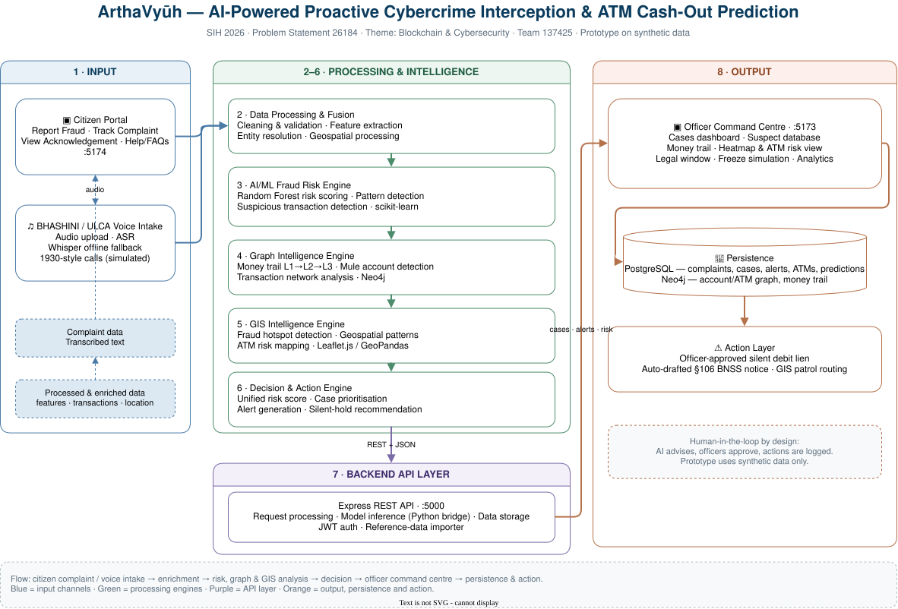

# ArthaVyūh — AI-Powered Proactive Cybercrime Interdiction & ATM Cash-Out Prediction

> **Smart India Hackathon 2026** · Problem Statement `26184` · Theme: *Blockchain & Cybersecurity*  
> Category: *Software* · Team ID: `137425`

ArthaVyūh moves police from the complaint desk to the cash-out point. One complaint drives
the whole chain: trace the fraud money to its exit account, predict the ATM where cash is
likely to be withdrawn, request an officer-approved silent hold, and dispatch police.

This repository contains a React command dashboard, a citizen complaint portal, an Express API, PostgreSQL/Neo4j persistence, notebook-based NLP/ATM analysis, and the datasets used by the prototypes. The two frontends are separate applications that share the same backend API; this integration does not replace either UI.

> **Prototype scope:** built on synthetic data. Government 1930/NCRP, banking, and telecom
> data is private and was not used. All metrics are indicative, not production results.

## System architecture

<!-- Replace this block with the rendered diagram image once exported.
     Open assets/system-architecture.drawio in the draw.io extension and
     export to PNG, then place it at assets/system-architecture.png -->



<!--

-->

The platform is organised as six processing stages between two input channels and a single
command centre:

```text
  INPUT                PROCESSING & INTELLIGENCE                    OUTPUT
┌──────────────┐
│ Citizen      │
│ Portal :5174 │──┐
└──────────────┘  │   ┌──────────────────────────────────────────┐
                  ├──▶│ 2  Data Processing & Fusion              │
┌──────────────┐  │   │  cleaning · features · entity · geo      │
│ BHASHINI     │──┘   ├──────────────────────────────────────────┤
│ voice intake │      │ 3  AI/ML Fraud Risk Engine               │   ┌──────────────────┐
└──────────────┘      │    Random Forest risk scoring            │──▶│ Officer Command  │
                      ├──────────────────────────────────────────┤   │ Centre  :5173    │
                      │ 4  Graph Intelligence (Neo4j)            │   │ cases · trail    │
                      │    L1→L2→L3 hops · exit account          │   │ heatmap · freeze │
                      ├──────────────────────────────────────────┤   │ analytics        │
                      │ 5  GIS Intelligence                      │   └──────────────────┘
                      │    Leaflet · hotspots · ATM risk map     │
                      ├──────────────────────────────────────────┤    ┌──────────────────┐
                      │ 6  Decision & Action Engine              │    │ PostgreSQL       │
                      │    unified risk · case prioritisation    │──▶│ Neo4j            │
                      └──────────────┬───────────────────────────┘    └──────────────────┘
                                     │ 7  Backend API layer (Express, :5000)
                                     ▼
                        8  Results: alerts & case data → dashboard
```

Stage responsibilities:

| # | Stage | Responsibility |
|---|---|---|
| 1 | Input | Citizen portal (report, track, acknowledgement) and BHASHINI voice intake |
| 2 | Data processing & fusion | Cleaning, validation, feature extraction, entity resolution, geospatial processing |
| 3 | AI/ML fraud risk engine | Random Forest ATM risk scoring, pattern and suspicious-transaction detection |
| 4 | Graph intelligence | Money-trail analysis, mule-account detection, transaction network graph |
| 5 | GIS intelligence | Heatmaps, fraud hotspots, geospatial pattern analysis, ATM risk mapping |
| 6 | Decision & action engine | Unified risk score, case prioritisation, alert generation |
| 7 | Backend API | Express REST layer, request processing, model inference, data storage |
| 8 | Officer command centre | Dashboards, suspect database, money trail, freeze simulation, analytics |

## Repository layout

```text
arthavyuh/
├── assets/            Architecture diagram source (draw.io XML)
├── backend/           Express API (:5000) — routes, controllers, services, DB config
│   └── scripts/       Seeding, reference-data import, connectivity checks
├── citizen-portal/    Citizen-facing Vite/React app (:5174)
├── frontend/          Command-center Vite/React app (:5173)
├── ml/                Python NLP + ATM-risk services, notebooks, unit tests
├── data/              Reference CSV datasets used by the importer and ML services
├── database/
│   ├── postgresql/    schema.sql + migrations/
│   └── neo4j/         constraints, import script, money-trail queries
└── docs/              Subsystem documentation
```

### Subsystem documentation

| Document | Covers |
|---|---|
| [`docs/atm-risk-and-money-trail.md`](docs/atm-risk-and-money-trail.md) | Random Forest ATM risk classifier, generated mule hops, Neo4j graph model, cash-out mapping |
| [`docs/nlp-triage-engine.md`](docs/nlp-triage-engine.md) | Audio ingestion, BHASHINI transcription, entity extraction, scam taxonomy |

## Runtime flow and current boundaries

```text
Citizen portal / command dashboard
             │ HTTP
             ▼
       Express API :5000
        ├── PostgreSQL: complaints, cases, alerts, ATMs, saved predictions
        ├── Python text analyzer: parser based on the existing Whisper notebook
        ├── Python ATM-risk classifier: existing ArthVyuh Random Forest logic
         └── Neo4j: complaint/account/transaction graph and stored cash-out mappings
```

The citizen portal submits the complaint text and fields already collected in its form. The API validates and stores the complaint and initial case in one PostgreSQL transaction, calls the existing notebook-derived text parser, and then runs the ATM-risk classifier against catalog ATMs whose city exactly matches the structured complaint location. NLP, inference, and Neo4j failures are reported without discarding a complaint already committed to PostgreSQL.

The citizen portal's optional prototype-audio flow uses the existing `POST /api/complaints/triage-voice` route. It sends a multipart audio upload to the backend, where `ml/bhashini_service.py` performs BHASHINI speech recognition/translation and `ml/nlp_service.py` parses the translated text. The response includes the source transcript, English translation, structured fields, unverified provenance, and a short-lived signed analysis token. Submitting the complaint still uses the existing `POST /api/complaints` endpoint and existing PostgreSQL complaint/case tables; the original transcript is retained as the complaint description and NLP details are stored in `complaints.nlp_result`. This is a local audio prototype, not a connection to the real 1930 helpline.

`ml/ArthVyuh.ipynb` trains a `RandomForestClassifier(n_estimators=100, random_state=42)` for ATM `risk_level` from the five existing ATM features and uses `predict_proba`. The callable implementation in `ml/atm_risk_service.py` uses those same features, labels, model settings, 80/20 stratified split, random seed, and `data/atms.csv` training rows. For a new complaint it classifies only same-city ATM catalog candidates; this is **ATM risk classification, not a complaint-to-ATM match or cash-out probability**. The returned class probability is explicitly marked as in-sample, held-out, or unseen-catalog and is not calibrated. Existing catalog candidates may have appeared in the notebook's training partition.

The notebook's `atm_cashout_mapping.csv` and `mule_hops.csv` are generated prototype data: the notebook rotates top-ranked ATMs within complaint city and fabricates hop account identifiers/amounts/timings. They are not supervised ground truth and are not used by the live candidate/risk flow. Wherever shown, they are labeled **"Imported/generated reference data — not verified cash-out events."** No complaint-triggered cash-out alerts are created.

The complaint API persists NLP output with extraction provenance and `verified: false`. Same-city candidate inference is persisted to existing `atms.predicted_risk_level`, `prediction_confidence`, `prediction_details`, and `prediction_updated_at` fields; original prediction CSV details remain in JSONB alongside `live_atm_risk_inference`. Existing `risk_score` / `risk_level` reference fields are not overwritten. The candidate list is derived from the exact normalized complaint-location-to-ATM-city match and returned by dashboard/case APIs. Candidate associations are not written as cash-out relationships in Neo4j.

## Prerequisites

- Node.js 20+ and npm
- Python 3.9+ (text parsing uses the standard library; ATM risk inference requires scikit-learn)
- PostgreSQL with a database named `cyber_fraud_db`
- Neo4j with a database named `cyber-fraud-db` (or configure `NEO4J_DATABASE`)
- FFmpeg for BHASHINI audio normalization; OpenAI Whisper is required only when automatic spoken-language detection is selected

Existing offline prediction/map source files are under `data/`. The command frontend also includes reference heatmap files under `frontend/public/`.

## Configure services

Copy `backend/.env.example` to `backend/.env` and set real local values. Do not commit `.env` or paste credentials into notebooks. `JWT_SECRET` must be a long random value. Set `POSTGRES_PASSWORD`, `NEO4J_PASSWORD`, and an initial analyst name/email/password locally. The seed password must be at least 12 characters.

Frontend API origins can be overridden with:

- `frontend/.env`: `VITE_API_URL=http://localhost:5000`
- `citizen-portal/.env`: `VITE_API_URL=http://localhost:5000`

The sample frontend `.env.example` files are safe templates; never add credentials there.

### Security: known exposed BHASHINI credentials

An earlier revision of this repository committed three live BHASHINI/ULCA credentials in
`backend/nlp_engine.py` (hardcoded as `os.getenv` fallbacks). That file has been deleted and
the credentials are no longer present in the working tree, but **they remain in git history**
and must be treated as compromised.

**Rotate them before any deployment or evaluation:**

1. Sign in to the ULCA/BHASHINI developer portal and revoke the existing `userID` and
   `ulcaApiKey`.
2. Issue a new key pair and store it **only** in your local `backend/.env`.
3. Never commit real credentials, and never paste them into notebooks or source files.

The current implementation (`ml/bhashini_service.py`) reads these values from the
environment and raises an explicit error when they are absent — it has no hardcoded
fallback.

For prototype audio analysis, set `BHASHINI_USER_ID` and `BHASHINI_API_KEY` in the backend `.env`; set `BHASHINI_INFERENCE_KEY` only if the BHASHINI configuration response does not provide one. These credentials are used only by the backend. Select a spoken language in the citizen portal to avoid the optional Whisper-based automatic language detector.

For the backend, copy `backend/.env.example` to `backend/.env` and provide a long random `JWT_SECRET`, existing PostgreSQL/Neo4j connection settings, and an initial analyst name/email/password (at least 12 characters). Keep `.env` local and do not paste credentials into source files or notebooks. The example does not contain real credentials.

## Initialize PostgreSQL and reference data

Create the existing database/schema first; these instructions do not create another database or remove tables/data:

```powershell
psql -U postgres -d cyber_fraud_db -f database/postgresql/schema.sql
psql -U postgres -d cyber_fraud_db -f database/postgresql/migrations/001_application_integration.sql
```

The migration is additive: it adds NLP/evidence and prediction metadata columns, safe ID sequences/defaults for new records, and `complaint_cashout_predictions` for the mapping output already produced by the notebook.

Set up the initial analyst using the credentials in `backend/.env`, then import the repository's reference datasets (re-running the importer is safe for existing rows):

```powershell
cd backend
npm install
npm run seed:analyst
npm run import:data
```

The import uses `ON CONFLICT` and does not delete existing rows. It updates existing ATM rows from the notebook's prediction CSV and imports only complaint/ATM mappings whose referenced complaint and ATM exist.

Install the Python inference dependency from the repository root:

```powershell
python -m pip install -r ml/requirements.txt
```

The ATM classifier is trained from `data/atms.csv` when inference is requested. It expects all five features to be present on each candidate. It returns `risk_level` and the maximum `predict_proba` class probability, explicitly labeled as uncalibrated/in-sample. The model's output concerns ATM catalog risk; it does not identify where complaint funds went.

## Start the applications

Use separate terminals:

```powershell
cd backend
npm run dev
```

```powershell
cd frontend
npm install
npm run dev
```

```powershell
cd citizen-portal
npm install
npm run dev
```

The command frontend uses `http://localhost:5173`; the citizen portal uses `http://localhost:5174`. The backend's allowed origins are configurable with `FRONTEND_ORIGINS`.

## API endpoints

| Method | Endpoint | Purpose | Authentication |
|---|---|---|---|
| GET | `/` | Backend liveness | Public |
| GET | `/api/health` | PostgreSQL/Neo4j readiness (degraded state is explicit) | Public |
| POST | `/api/auth/login` | Analyst login; returns JWT | Public |
| POST | `/api/complaints` | Validate, persist, analyze text, infer ATM risk for exact same-city candidates, and best-effort graph sync | Public citizen intake |
| POST | `/api/complaints/triage-voice` | Analyze a multipart audio upload with BHASHINI and the existing NLP parser; does not create a complaint | Public citizen intake |
| GET | `/api/complaints/:complaintNumber/status?phone=...` | Match complaint number to registered phone | Public |
| GET | `/api/complaints` | List complaints | Analyst JWT |
| GET | `/api/cases` | List cases | Analyst JWT |
| GET | `/api/cases/:caseId` | Fetch by numeric ID or case number | Analyst JWT |
| GET | `/api/atms` | List ATM rows | Analyst JWT |
| GET | `/api/alerts` | List alerts | Analyst JWT |
| GET | `/api/dashboard` | Aggregated complaints, cases, ATMs and alerts | Analyst JWT |
| POST | `/api/nlp/analyze` | Analyze complaint text with the existing parser | Analyst JWT |
| GET | `/api/ml/predictions` | Read persisted notebook prediction results | Analyst JWT |
| POST | `/api/ml/result` | Persist an ML-produced ATM score/level/confidence | Analyst JWT |
| GET | `/api/fraud/trace/:complaintId` | Read supported Neo4j complaint relationships | Analyst JWT |

## Verification and troubleshooting

```powershell
cd backend
npm test                 # integration suite (requires a running PostgreSQL + Neo4j)
npm run check:db         # verify PostgreSQL connectivity only
npm run check:neo4j      # verify Neo4j connectivity only
node --check server.js
cd ..\frontend
npm run build
cd ..\citizen-portal
npm run build
cd ..\ml
python -m unittest test_nlp_service.py test_atm_risk_service.py
```

`npm test` runs the integration suite only. The standalone connectivity checks are separate
scripts (`backend/scripts/checkDatabaseConnection.js`, `backend/scripts/checkNeo4jConnection.js`)
because Node's test runner auto-discovers files matching `test-*.js`.

- `/api/health` reports `degraded` if PostgreSQL or Neo4j is unreachable or not configured. The backend can still start without Neo4j; graph operations report an unavailable status.
- Login requires a PostgreSQL user whose password is a bcrypt hash. The sample CSV's `hashed_password_*` values are placeholders, not usable credentials.
- Create the first analyst after setting the local backend `.env` values: `cd backend; npm run seed:analyst`. The script refuses to overwrite an existing email. Login uses `POST /api/auth/login`; dashboard, cases, ATM, alert, NLP, prediction, and trace routes require its analyst JWT.
- If a complaint saves but NLP/Neo4j is down, inspect the response's `nlp` and `graph` statuses and backend logs. The PostgreSQL complaint and case remain saved.
- `atm_candidates.status` in a complaint response is `inferred`, `no_catalog_city_match`, `not_applicable`, or `failed`. A candidate means only an exact normalized match between complaint location and ATM catalog city.
- The prototype does not create complaint-triggered alerts. Existing alerts are imported/read-only in this flow; a risk-only notification policy would need approval before one is generated.
- The case detail page shows live PostgreSQL complaint/NLP data, same-city candidates, the ATM-risk output/features, and a candidate-only map. Its reference mapping section is separate and carries the not-verified-cash-out label.
- The Analytics page still contains bundled sample KPIs/charts; it labels them as illustrative and not live database metrics or model evaluation.
- If ATM data is empty, apply the migration and run `npm run import:data`; the UI may use clearly labeled bundled prediction files only when the prediction API is unavailable.
- Bhashini API credentials in old notebooks were removed from executable cells; configure credentials through environment variables before using that notebook pipeline. No credentials are required for the text endpoint.
- No complaint-to-ATM/cash-out prediction model, verified cash-out feed, binary evidence upload, calibrated ATM-risk probability, or live cell-tower feed is deployed. BHASHINI audio transcription requires server-side credentials and FFmpeg; automatic language detection additionally requires Whisper. No direct 1930 helpline integration exists. The current historical mapping and hop outputs are generated prototype data and are not used as supervised labels.

## Phase 2B verification

```powershell
cd ml
python -m unittest test_nlp_service.py test_atm_risk_service.py
cd ..\backend
npm test
```

The backend integration test starts the integrated server on a temporary port, creates a temporary analyst and test complaint in the configured databases, verifies health/login/protected APIs, NLP persistence, ATM inference and trace, then removes only its exact test complaint/case/user/graph nodes and restores the affected ATM prediction fields.
