# ArthaVyūh — End-to-End Workflow

> Companion to the [root README](README.md). This document walks one complaint from the moment
> a citizen speaks or types it, through parallel analysis, to the officer's decision.
> Setup and API reference stay in the README; subsystem internals stay in
> [`docs/atm-risk-and-money-trail.md`](docs/atm-risk-and-money-trail.md) and
> [`docs/nlp-triage-engine.md`](docs/nlp-triage-engine.md).

> **Prototype scope:** every figure, account, ATM, hop and graph edge below is synthetic or
> generated. Government 1930/NCRP, banking and telecom data is private and was not used.

---

## 1. The idea in one line

> One complaint drives the whole chain: **triage → trace → predict → hold → dispatch.**

Fraud money moves through mule accounts and leaves at an ATM within hours. ArthaVyūh takes the
intake, turns it into a live case, runs three analyses on it *at the same time*, ranks the ATM
cluster where the cash is likely to land, and puts an officer-approved freeze request in front of
a human while the window is still open.

The operating principle is that **the machine never freezes anything on its own**. It ranks,
proposes and drafts; a human authorises. Every AI-produced field carries a `verified: false`
flag and a provenance string.

---

## 2. The full pipeline at a glance

```text
                             ┌──────────────────────────────┐
 CITIZEN PORTAL  :5174       │   COMPLAINT INTAKE           │  BHASHINI VOICE  :5174
 form + text ───────────────▶│   validate → store → case    │◀── audio, 14 languages
                             └───────────────┬──────────────┘
                                             │ POST /api/complaints → 201
                                             ▼
                        ┌────────────────────────────────────────┐
                        │   PostgreSQL transaction                │
                        │   complaints + cases  (atomic)         │
                        └───────────────────┬────────────────────┘
                                            │
             ┌──────────────────────────────┼──────────────────────────────┐
             │                              │                              │
      ┌──────▼───────┐               ┌───────▼──────┐               ┌───────▼──────┐
      │  BRANCH A    │               │  BRANCH B    │               │  BRANCH C    │
      │  NLP triage  │               │  ATM risk    │               │  Graph sync  │
      │  ml/nlp_     │               │  Random      │               │  Neo4j       │
      │  service.py  │               │  Forest      │               │  MERGE nodes │
      └──────┬───────┘               └───────┬──────┘               └───────┬──────┘
             │                              │                              │
             └───────────▶ response ◀────────┴──────────────────────────────┘
                 { complaint, case, nlp, atm_candidates, graph }
                                            │
                                            ▼
        ┌───────────────────────────────────────────────────────────────┐
        │  OFFICER COMMAND CENTRE  :5173                                 │
        │  dashboard → case → ATM intel → money trail → legal window    │
        │           → freeze simulation → export / dispatch             │
        └───────────────────────────────────────────────────────────────┘
```

The three branches are **independent and non-fatal**. Each is wrapped in its own `try/catch`, so
a failure in one degrades only that capability and still returns `201` with the complaint safely
committed. See [§7 Failure semantics](#7-failure-semantics).

---

## 3. Stage 1 — Intake

Two channels converge on the same normalised complaint record.

### 3a. Citizen portal (text)

The citizen reports through the form (`citizen-portal/`, port `5174`), entering name, phone,
amount, fraud date/time, account and transaction identifiers, location and description. This
submits directly to `POST /api/complaints`.

### 3b. BHASHINI voice (audio)

A caller speaks instead of typing. This is a **separate, optional** call that returns analysis
for the officer *before* the complaint is submitted.

```text
POST /api/complaints/triage-voice        (multipart/form-data, ≤ 20 MB)
        │
        ▼
Multer writes to a temp dir · FFmpeg normalises to 16 kHz mono PCM WAV
        │
        ▼
BHASHINI  ASR → translation             (Hindi default; Whisper `base` fallback on failure)
        │
        ▼
English transcript
        │
        ▼
ml/nlp_service.py — rule-based entity extraction
        │
        ▼
{ transcript, translated_text, structured_complaint, analysis_token }
```

The response carries a **short-lived signed JWT** (`purpose: bhashini_audio_complaint`,
`expiresIn: 15m`, issuer `arthavyuh-backend`) so the analysis cannot be replayed or edited in
transit. The caller then submits through the normal `POST /api/complaints`, and the transcript
becomes the complaint description. The temp upload is deleted in a `finally` block regardless of
outcome.

| Failure stage | HTTP | Meaning |
|---|---|---|
| `upload` | 400 / 413 / 415 | Missing file, over 20 MB, or unsupported content type |
| `language_selection` | 400 | Language code outside the 14 supported set |
| `configuration` | 503 | `JWT_SECRET` unset |
| `nlp_parsing` | 422 | Incomplete result — empty or oversized transcript |
| `audio_processing` | 503 / 500 | BHASHINI or Python runtime failure |

### 3c. What the NLP parser extracts

`ml/nlp_service.py` is **rule-based, not statistical** — it handles spoken Indian numeric
phrasing (*lakh*, *hazar*, comma-separated values) that a naive number parser would miss.

| Field | Examples resolved |
|---|---|
| Stolen amount | "two lakh fifty thousand", "1,50,000" |
| Payment channel | `UPI`, `IMPS`, `NEFT`, `RTGS`, `CARD_PAYMENT`, `NET_BANKING` |
| Mule identifiers | VPAs, `user@bank`, comma-separated tokens, raw account strings |
| Scam category | `DIGITAL_ARREST`, `TASK_JOB_FRAUD`, `INVESTMENT_TRADING_FRAUD`, `LOAN_APP_EXTORTION`, `CREDIT_CARD_FRAUD`, `REMOTE_ACCESS_MALWARE`, `UTILITY_BILL_FRAUD`, `FINANCIAL_FRAUD` |

---

## 4. Stage 2 — Persistence (the only atomic step)

`createComplaint` in `backend/controllers/complaintController.js` is the one place where
correctness actually matters.

```text
BEGIN
  INSERT complaints  →  complaint_number = CMP######
  INSERT cases       →  case_number      = CASE######,  status = Received
COMMIT                            ← both rows, or neither
```

Complaint and case numbers come from dedicated ID sequences created by migration
`001_application_integration.sql`, so concurrent writers cannot collide. **If this transaction
fails, nothing is written** — there is never a half-created case for an officer to chase.

Everything after this point is *enrichment*, and is allowed to fail independently.

---

## 5. Stage 3 — Parallel enrichment

Three branches run after the commit. None of them depends on another.

### 5a. Branch A — NLP triage

Spawns `ml/nlp_service.py` over a JSON stdin pipe (10 s timeout, 1 MB output cap) and writes the
result to `complaints.nlp_result`, always stamped `verified: false` alongside a `provenance`
field naming the speech engine and parser that produced it. The original transcript is preserved
as the complaint description.
### 5b. Branch B — ATM cash-out risk inference

This is the differentiator. Implemented in `inferSameCityAtmRisk`.

```text
complaint.location
        │  exact normalised match:  LOWER(BTRIM(city)) = LOWER(BTRIM($1))
        ▼
atms catalog rows in that city
        │  JSON over stdin → ml/atm_risk_service.py      (30 s timeout)
        ▼
RandomForestClassifier(n_estimators=100, random_state=42)
        │  features: highway_distance, lighting_score, cctv_coverage,
        │            historical_fraud_count, withdrawal_limit
        ▼
risk_level ∈ {HIGH, MEDIUM, LOW}  +  predict_proba confidence
        │
        ▼
UPDATE atms SET predicted_risk_level, prediction_confidence,
                   prediction_details (jsonb), prediction_updated_at
```

Four details matter for honesty, and the API surfaces all of them:

- **Only exact same-city catalog candidates** are classified. No fuzzy geo-matching and no
  "nearest ATM" guessing. If no city matches, the status is `no_catalog_city_match`.
- **`prediction_details` is merged, not overwritten** (`||` on JSONB). The notebook's original
  CSV output stays readable next to the live `live_atm_risk_inference` block.
- **Existing `risk_score` / `risk_level` columns are never overwritten.** They hold reference
  catalog values; live inference goes into separate columns.
- **Every prediction is labelled with its provenance** — `in_sample`, `held_out` or
  `unseen_atm`, each suffixed `_class_probability_not_calibrated`. A probability produced for an
  ATM the model trained on is displayed differently from one it never saw.

> This is **ATM risk classification, not a complaint-to-ATM match and not a cash-out
> probability.** The model scores how risky each ATM *is*; it does not claim the money went there.
### 5c. Branch C — Neo4j graph sync

`syncComplaintGraph` MERGEs the complaint and its direct evidence into the transaction graph
inside a single `executeWrite` transaction.

```text
(:Complaint) --HAS_CASE--> (:Case)
     |-- IDENTIFIES_MULE_ACCOUNT--> (:Account)   provenance: complaint_text_nlp_extraction
     |-- INVOLVES----------------> (:Account)   provenance: complainant_submitted_account
     |-- HAS_TRANSACTION--------> (:Transaction) provenance: complainant_report
     `-- (:Account) --MADE--> (:Transaction) --AT_BANK--> (:Bank)
```

Every node and relationship written by this path carries `verified = false` and a `provenance`
string identifying its origin.

> **Deliberate boundary:** this branch writes only complainant-supplied and NLP-extracted facts.
> It **never** writes an ATM candidate association as a `LIKELY_CASHOUT_AT` edge. That
> relationship exists in the graph model only for the *generated* reference data imported from
> `data/` (`provenance: generated_prototype_mapping`). Conflating the two would dress a model
> guess up as an observation. Candidate associations are returned in the API response for the
> dashboard to display; they are not persisted as fact.
### 5d. What the response looks like

```jsonc
// POST /api/complaints  ->  201 Created
{
  "complaint": { "complaint_number": "CMP100001" },
  "case":      { "case_number": "CASE500001", "status": "Received" },
  "nlp":       { "status": "complete", "data": { "verified": false } },
  "atm_candidates": {
    "status": "scored",
    "candidates": [
      {
        "atm_id": "ATM100076",
        "candidate_type": "same_city_atm_candidate",
        "candidate_basis": "Exact normalized match between complaint location and ATM catalog city",
        "atm_risk_level": "HIGH",
        "atm_risk_confidence": 71.8,
        "confidence_type": "held_out_class_probability_not_calibrated",
        "risk_model": "ArthVyuh.ipynb: n_estimators=100, random_state=42",
        "model_features": { "historical_fraud_count": 12 }
      }
    ]
  },
  "graph": { "status": "synced" }
}
```

Note how little the server asserts: a **candidate** list with a stated **basis**, a **confidence
type**, and the **model version** that produced it. Nothing is reported as established fact.

---

## 6. Stage 4 — The officer decision loop

The command centre (`frontend/`, port `5173`) is where ranking becomes action. Every screen is a
route in `frontend/src/App.jsx`.

| # | Screen | Route | What the officer does |
|---|---|---|---|
| 1 | **Command dashboard** | `/` | Triage entry point: amount at risk, priority alerts (24 h), accounts frozen, top active cases by amount, live intake feed |
| 2 | **Voice triage** | `/voice-triage` | Review BHASHINI transcripts and extracted fields as the Helpline operator |
| 3 | **Case management** | `/case-management` | Filter by region, crime type, risk, status and date; open a case |
| 4 | **Case detail** | `/cases/:caseId` | The case spine: status, timeline, linked accounts/ATMs/suspects and quick links into every downstream tool |
| 5 | **ATM intelligence** | `/atm-intelligence` | Region risk score, cash-out pattern, predicted withdrawal window, ranked ATM watchlist, caller-location risk zone |
| 6 | **Money trail** | `/money-trail` | Expand victim to mule hops to cash-out nodes across the Neo4j graph |
| 7 | **Legal window** | `/legal` | Generate the BNSS Section 106 freeze notice for the bank's nodal officer from live case fields |
| 8 | **Freeze simulation** | `/freeze-sim` | Preview what the mule and ATM experience: no-freeze, silent-freeze or declined |
| 9 | **Analytics** | `/analytics` | Case trends by region/risk/status; ML model performance and confusion matrix |
| 10 | **Registries** | `/suspects` | Suspect and mule-account databases with inflow/outflow totals and bank sync |
| 11 | **Export** | `/export` | Case and evidence reports, CSV evidence export with SHA-256 chain hashes |

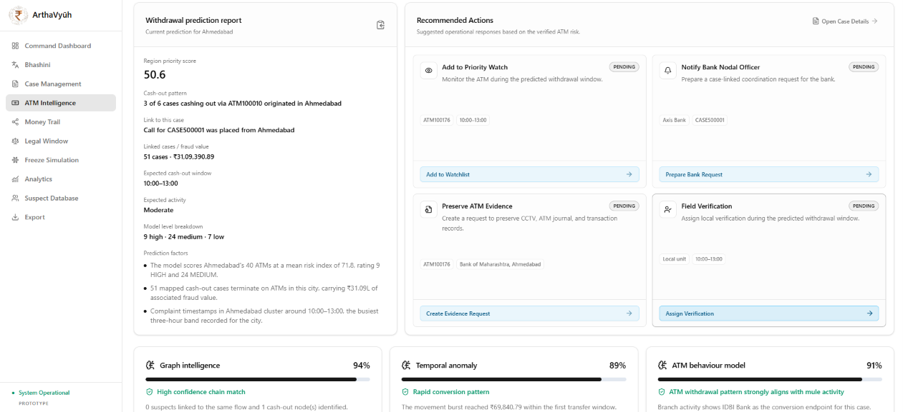

*The prediction report is where Branch B's output becomes action: region score, expected cash-out
window, the three confidence signals (graph, temporal, ATM behaviour), and a set of
**recommended actions** that stay `PENDING` until a human takes them.*

```text
  intake ──▶ rank ──▶ review ──┬──▶ Section 106 notice ──▶ bank ──▶ freeze holds
                                ├──▶ freeze simulation ────▶ what the scammer sees
                                └──▶ evidence export ─────▶ chain of custody
```

The **legal window is the operational race**. Funds become harder to recover the longer they sit
in a mule account, so the freeze request must be prepared while the prediction is still being
reviewed.

---

## 7. Failure semantics

Design rule: **a complaint is never lost to an enrichment failure.** Each branch catches its own
error and reports degraded capability explicitly instead of failing the whole request.

| Branch | Independent failure | Resulting status |
|---|---|---|
| Persistence | Transaction fails | **No rows written**; the request fails, which is correct since nothing partial should exist |
| A - NLP | Parser crashes or times out | `nlp: { status: "failed", message: "Text analysis is unavailable; the original complaint was saved" }` |
| B - ATM risk | Python missing, timeout, or arity/order mismatch | `atm_candidates: { status: "failed", reason: "ATM risk inference is unavailable; no cash-out relationship was inferred" }` |
| B - no city match | Complaint location absent from the catalog | `atm_candidates: { status: "no_catalog_city_match" }` - an honest empty result, not a guess |
| C - Graph | Neo4j down or unconfigured | `graph: { status: "failed", message: "Graph synchronization is unavailable; the complaint remains in PostgreSQL" }` |

The controller also guards against two subtle bugs:

- **Arity check** - if Python returns a different number of predictions than candidates were sent,
  it throws instead of silently mis-pairing scores to the wrong ATMs.
- **Order check** - each returned prediction's `atm_id` must match its input row, or it throws.
  Results are zipped by index, so an upstream reordering would otherwise attach the wrong risk to
  the wrong ATM.

`GET /api/health` reports `ready` only when **both** PostgreSQL and Neo4j answer, so the command
dashboard can display a truthful operational banner.

---

## 8. Where each stage lives

| Stage | Code |
|---|---|
| Citizen form | `citizen-portal/src/citizen/pages/ReportFraud/ReportFraud.jsx` |
| Voice intake route | `backend/routes/complaintRoutes.js` -> `triage-voice` |
| Complaint and case write | `backend/controllers/complaintController.js` |
| Node to Python bridge | `backend/services/nlpService.js`, `backend/services/atmRiskService.js` |
| Speech and translation | `ml/bhashini_service.py` |
| Entity extraction | `ml/nlp_service.py` (tests: `ml/test_nlp_service.py`) |
| ATM classifier | `ml/atm_risk_service.py` (tests: `ml/test_atm_risk_service.py`) |
| Graph sync | `backend/services/neo4jService.js` |
| Graph queries | `database/neo4j/money_trail_queries.cypher` |
| Reference data | `data/`, imported by `backend/scripts/importReferenceData.js` |
| Command centre | `frontend/src/pages/*.jsx`, `frontend/src/components/command/*.jsx` |
| Schema | `database/postgresql/schema.sql` + `migrations/001_application_integration.sql` |

---

## 9. Honest boundaries

What this prototype **does not** do, stated plainly so nobody over-reads a demo:

- **No real data.** All complaints, accounts, ATMs, mule hops and cash-out mappings are synthetic
  or generated. No 1930/NCRP, banking or telecom feed is connected.
- **Mule hops are fabricated.** `mule_hops.csv` and `atm_cashout_mapping.csv` are produced by a
  notebook that rotates top-ranked ATMs within a city and invents hop accounts, amounts and
  timings. They are **not supervised ground truth** and are labelled
  *"Imported/generated reference data - not verified cash-out events"* wherever they appear.
- **A prediction is not evidence.** A high-risk ATM score does not prove a withdrawal happened
  there, and no cash-out alert is generated from a complaint.
- **Probabilities are uncalibrated.** They are raw `predict_proba` maxima, tagged with whether the
  ATM was in-sample, held-out or unseen.
- **The freeze is a simulation.** Legal notices and silent-freeze previews are rendered from
  stored case fields; nothing is actually sent to a bank.
- **Extraction is rule-based.** Unseen phrasing in a regional language is missed.
- **All NLP output is unverified** (`verified: false`); none of it is police-verified fact.

Real deployment would need authorized access to banking transaction data, ATM withdrawal records,
live complaint feeds, and banking / law-enforcement integration.

---

## 10. Visual walkthrough

Every screen in the prototype, in pipeline order. The caption states the stage each one belongs to.

| Screen | Stage |
|---|---|
| 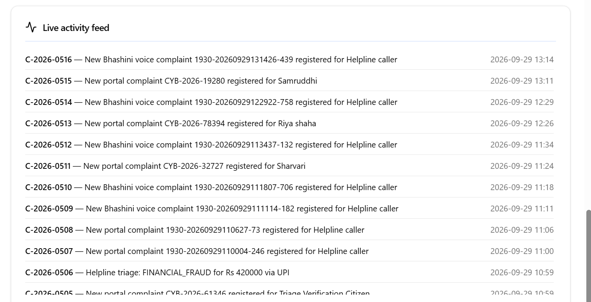 | Section 3 - portal and voice intake arriving in real time |
| 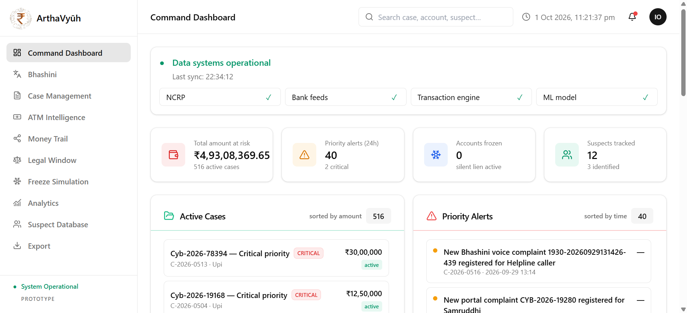 | Section 6 step 1 - amount at risk, priority alerts, active cases |
| 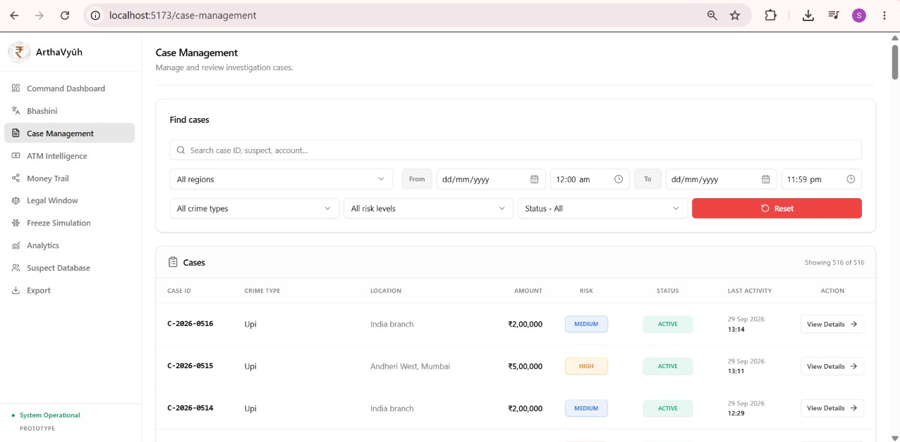 | Section 6 step 3 - the filtered case queue |
| 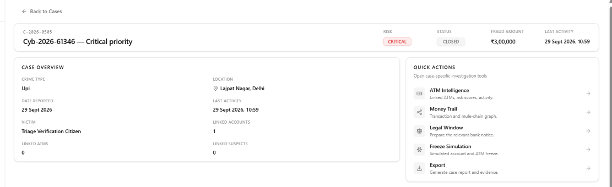 | Section 6 step 4 - the case spine and its quick links |
| 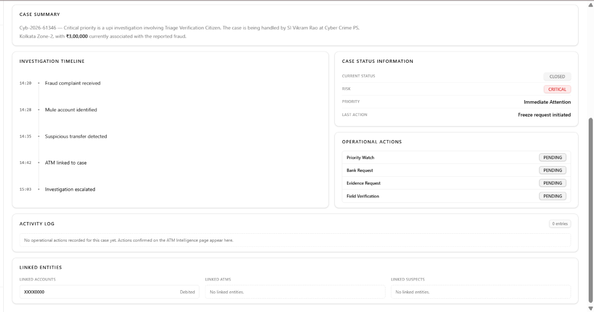 | Section 6 step 4 - investigation timeline and operational actions |
| 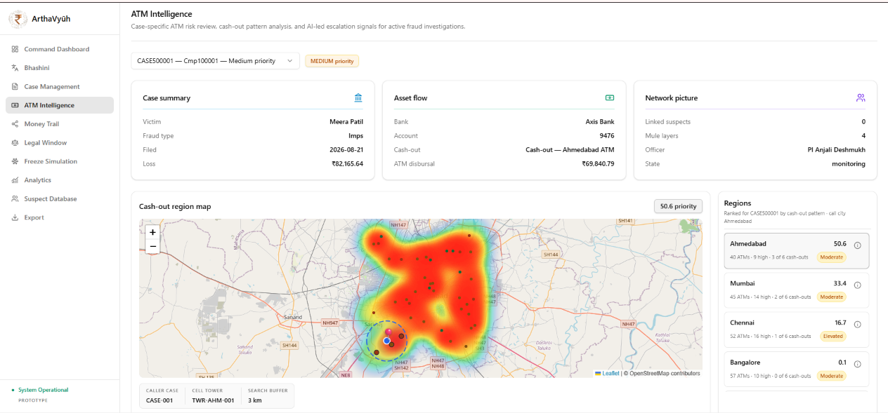 | Section 6 step 5 - case summary, asset flow, region heatmap |
| 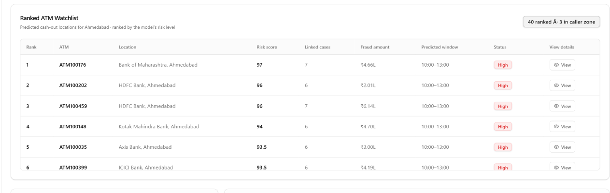 | Section 5 Branch B - ranked ATMs with confidence type |
|  | Section 6 step 5 - prediction factors and pending recommended actions |
| 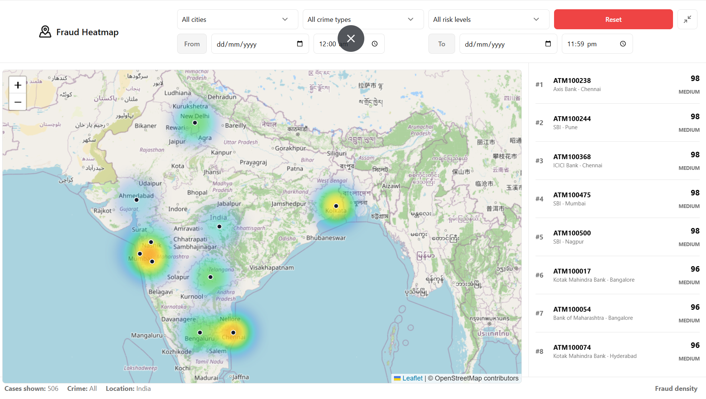 | Section 6 step 5 - GIS layer, fraud density by city, crime, risk and time |
| 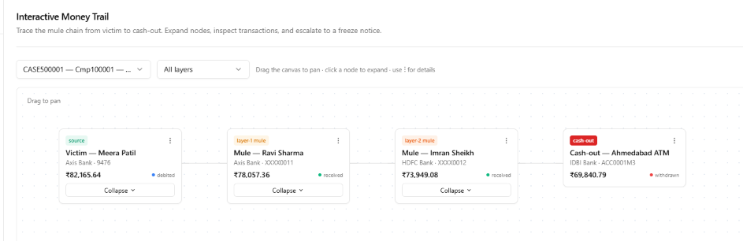 | Section 5 Branch C - victim to mule hops to cash-out |
| 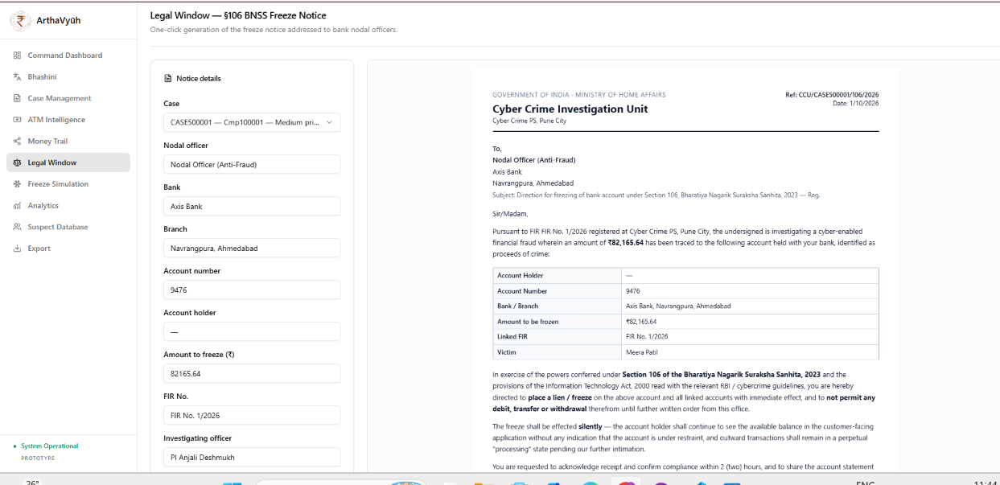 | Section 6 step 7 - BNSS Section 106 notice from live case fields |
| 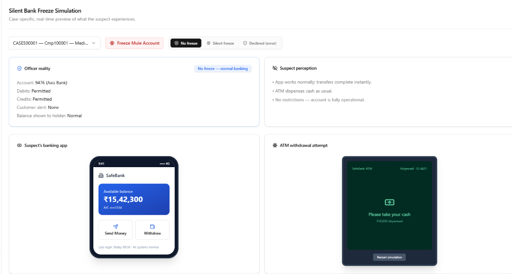 | Section 6 step 8 - what the mule and ATM experience per outcome |
| 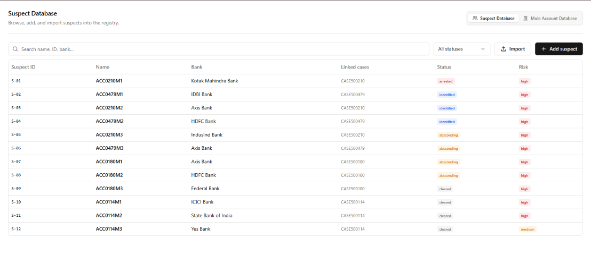 | Section 6 step 10 - suspect registry linked to cases |
| 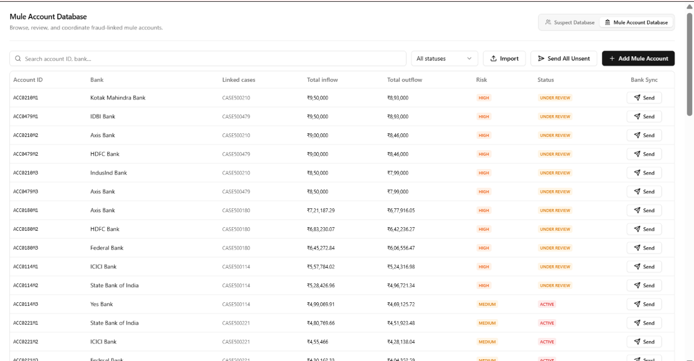 | Section 6 step 10 - mule accounts with inflow, outflow and bank sync |
| 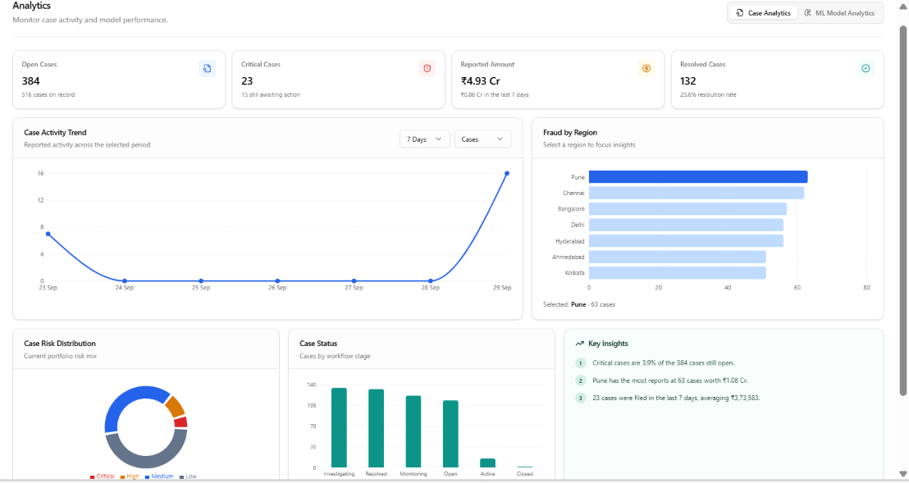 | Section 6 step 9 - case trends by region, risk and status |
| 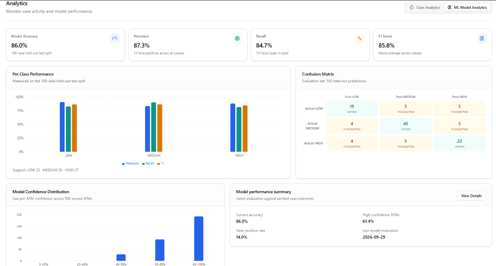 | Section 6 step 9 - classifier precision, recall, F1 and confusion matrix |
| 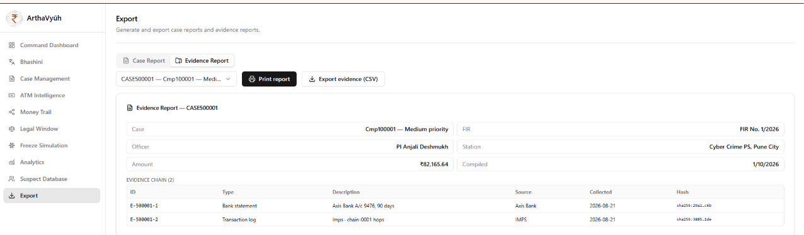 | Section 6 step 11 - evidence export with SHA-256 chain hashes |